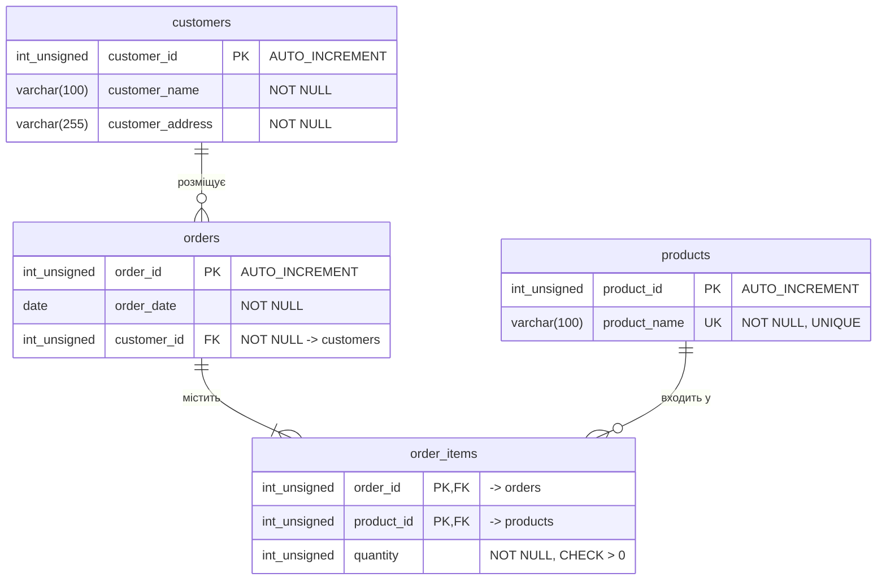
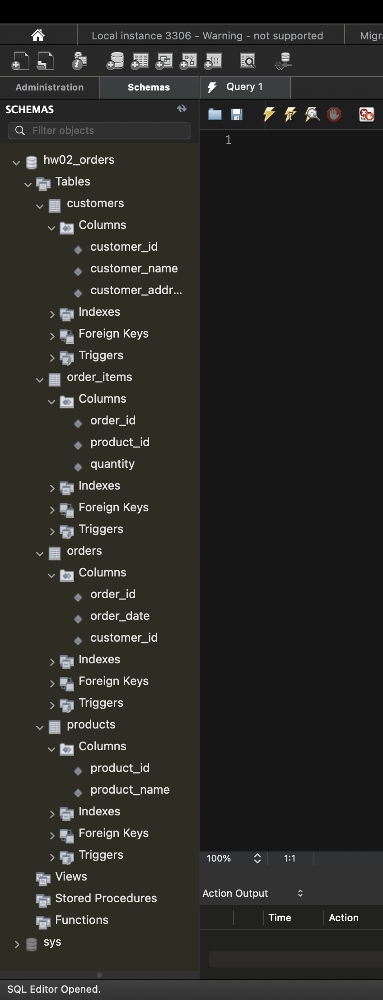
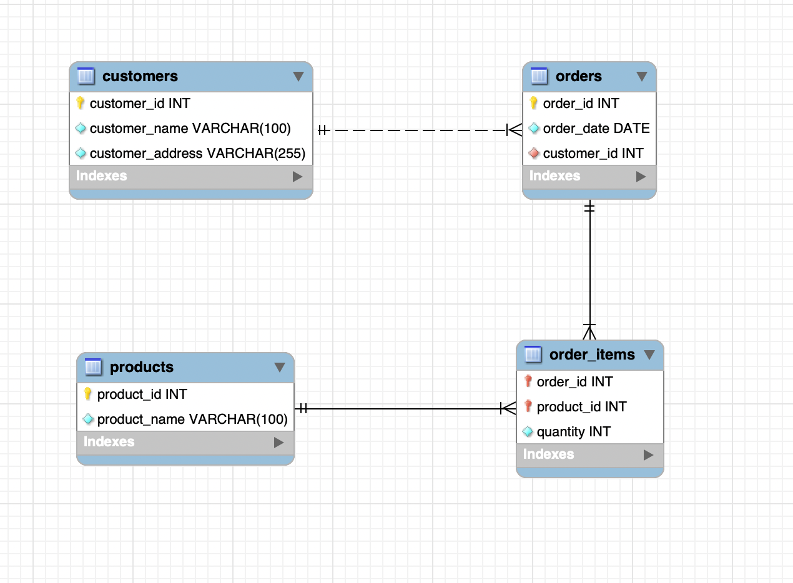

# Проєктування баз даних з використанням семантичних моделей

Домашнє завдання 2. Нормалізація початкової таблиці до 1НФ → 2НФ → 3НФ,
побудова ER-діаграми та створення таблиць у MySQL.

```
rdb_hw_topic_02/
├── normalization/
│   ├── p1_1nf.md                 # пункт 1
│   ├── p2_2nf.md                 # пункт 2
│   └── p3_3nf.md                 # пункт 3
├── er/
│   └── p4_er_diagram.md          # пункт 4 — ER-діаграма, сутності, зв'язки
├── sql/
│   └── p5_create_tables.sql      # пункт 5 — DDL
└── screenshots/
    ├── p5_workbench_schema.png   # пункт 5 — розгорнута схема у Workbench
    └── p5_workbench_eer.png      # пункт 5 — EER-діаграма з реальної БД
```

## Початкова таблиця (додаток №1)

| Номер_замовлення | Назва_товару і кількість | Адреса_клієнта | Дата_замовлення | Клієнт |
|------------------|--------------------------|----------------|-----------------|-----------|
| 101 | Лептоп: 3, Мишка: 2 | Хрещатик 1 | 2023-03-15 | Мельник |
| 102 | Принтер: 1 | Басейна 2 | 2023-03-16 | Шевченко |
| 103 | Мишка: 4 | Комп'ютерна 3 | 2023-03-17 | Коваленко |

---

## Пункт 1. Переведення початкової таблиці в першу нормальну форму

**Порушення 1НФ:** комірка `Назва_товару і кількість` неатомарна — містить
список `Лептоп: 3, Мишка: 2`; крім того, один стовпець зберігає два різні
факти — назву товару й кількість.

**Дії:** розділити стовпець на `product_name` і `quantity`, кожен товар
винести в окремий рядок, оголосити складений первинний ключ.

### Результат — таблиця `orders_1nf`

**PK:** `(order_id, product_name)`

| order_id | product_name | quantity | customer_name | customer_address | order_date |
|----------|--------------|----------|---------------|------------------|------------|
| 101 | Лептоп  | 3 | Мельник   | Хрещатик 1     | 2023-03-15 |
| 101 | Мишка   | 2 | Мельник   | Хрещатик 1     | 2023-03-15 |
| 102 | Принтер | 1 | Шевченко  | Басейна 2      | 2023-03-16 |
| 103 | Мишка   | 4 | Коваленко | Комп'ютерна 3  | 2023-03-17 |

Детальний розбір із типами даних — [normalization/p1_1nf.md](normalization/p1_1nf.md)

---

## Пункт 2. Переведення нових таблиць у другу нормальну форму

**Порушення 2НФ:** часткові залежності від складеного ключа —
`order_date`, `customer_name`, `customer_address` залежать тільки від
`order_id`, а не від усього ключа `(order_id, product_name)`.

**Дії:** винести атрибути замовлення в окрему таблицю з простим ключем
`order_id`; у таблиці позицій залишити тільки `quantity`.

### Результат — дві таблиці

**`orders`** · PK: `order_id`

| order_id | order_date | customer_name | customer_address |
|----------|------------|---------------|------------------|
| 101 | 2023-03-15 | Мельник   | Хрещатик 1    |
| 102 | 2023-03-16 | Шевченко  | Басейна 2     |
| 103 | 2023-03-17 | Коваленко | Комп'ютерна 3 |

**`order_items`** · PK: `(order_id, product_name)` · FK: `order_id` → `orders`

| order_id | product_name | quantity |
|----------|--------------|----------|
| 101 | Лептоп  | 3 |
| 101 | Мишка   | 2 |
| 102 | Принтер | 1 |
| 103 | Мишка   | 4 |

Аналіз функціональних залежностей і аномалій —
[normalization/p2_2nf.md](normalization/p2_2nf.md)

---

## Пункт 3. Переведення нових таблиць у третю нормальну форму

**Порушення 3НФ:** транзитивна залежність
`order_id → customer_name → customer_address` — адреса описує клієнта, а не
замовлення. Додатково: назва товару дублюється текстом у кожній позиції.

**Дії:** винести клієнта в довідник `customers`, товар — у довідник
`products`; текстові значення замінити зовнішніми ключами.

### Результат — чотири таблиці

**`customers`** · PK: `customer_id`

| customer_id | customer_name | customer_address |
|-------------|---------------|------------------|
| 1 | Мельник   | Хрещатик 1    |
| 2 | Шевченко  | Басейна 2     |
| 3 | Коваленко | Комп'ютерна 3 |

**`products`** · PK: `product_id`

| product_id | product_name |
|------------|--------------|
| 1 | Лептоп  |
| 2 | Мишка   |
| 3 | Принтер |

**`orders`** · PK: `order_id` · FK: `customer_id` → `customers`

| order_id | order_date | customer_id |
|----------|------------|-------------|
| 101 | 2023-03-15 | 1 |
| 102 | 2023-03-16 | 2 |
| 103 | 2023-03-17 | 3 |

**`order_items`** · PK: `(order_id, product_id)` · FK: → `orders`, → `products`

| order_id | product_id | quantity |
|----------|------------|----------|
| 101 | 1 | 3 |
| 101 | 2 | 2 |
| 102 | 3 | 1 |
| 103 | 2 | 4 |

Перевірка кожної таблиці на 3НФ і доказ, що дані не втрачено —
[normalization/p3_3nf.md](normalization/p3_3nf.md)

---

## Пункт 4. ER-діаграма отриманих таблиць



Ту саму схему, побудовану з реальної бази даних, видно на
[EER-діаграмі з Workbench](screenshots/p5_workbench_eer.png) (пункт 5).

### Зв'язки та кардинальності

| Зв'язок | Кардинальність | Читається |
|---------|----------------|-----------|
| `customers` → `orders` | 1 : 0..N | Один клієнт — багато замовлень; замовлення належить рівно одному клієнту |
| `orders` → `order_items` | 1 : 1..N | Одне замовлення містить одну або більше позицій |
| `products` → `order_items` | 1 : 0..N | Один товар може входити в багато замовлень або в жодне |
| `orders` ↔ `products` | M : N | Розв'язується таблицею-зв'язкою `order_items` |

Повний перелік атрибутів, типів даних, обмежень та обов'язковості участі —
[er/p4_er_diagram.md](er/p4_er_diagram.md)

---

## Пункт 5. Створення таблиць у базі даних

Таблиці створено автоматично — скриптом
[sql/p5_create_tables.sql](sql/p5_create_tables.sql), який виконано в MySQL
Workbench. Скрипт створює схему `hw02_orders` і чотири таблиці з усіма
первинними, зовнішніми та унікальними ключами — **без даних**, як вимагає умова.

### Розгорнута схема у Workbench



### EER-діаграма, побудована з реальної БД



### Підсумкова структура

| Таблиця | Первинний ключ | Зовнішні ключі |
|---------|----------------|----------------|
| `customers`   | `customer_id` | — |
| `products`    | `product_id` | — |
| `orders`      | `order_id` | `customer_id` → `customers` |
| `order_items` | `(order_id, product_id)` | `order_id` → `orders`, `product_id` → `products` |

### Як відтворити

1. MySQL Workbench → **File → Open SQL Script…** → `sql/p5_create_tables.sql`
2. Виконати весь скрипт кнопкою ⚡ (*Execute All or Selection*)
3. У панелі **SCHEMAS** натиснути ⟳ (Refresh) — з'явиться схема `hw02_orders`

---

## Відповідність критеріям прийняття

| Критерій прийняття | Пункт ДЗ | Файли |
|--------------------|----------|-------|
| **2.** Нормалізовано до 1НФ | пункт 1 | [normalization/p1_1nf.md](normalization/p1_1nf.md) |
| **3.** Нормалізовано до 2НФ | пункт 2 | [normalization/p2_2nf.md](normalization/p2_2nf.md) |
| **4.** Нормалізовано до 3НФ | пункт 3 | [normalization/p3_3nf.md](normalization/p3_3nf.md) |
| **5.** ER-діаграма з кількох таблиць зі зв'язками | пункт 4 | [er/p4_er_diagram.md](er/p4_er_diagram.md), [screenshots/p5_workbench_eer.png](screenshots/p5_workbench_eer.png) |
| **6.** Зрозумілі імена, типи даних, кардинальності | пункт 4 | [er/p4_er_diagram.md](er/p4_er_diagram.md) |
| **7.** Створено таблиці в БД | пункт 5 | [sql/p5_create_tables.sql](sql/p5_create_tables.sql), [screenshots/p5_workbench_schema.png](screenshots/p5_workbench_schema.png) |
