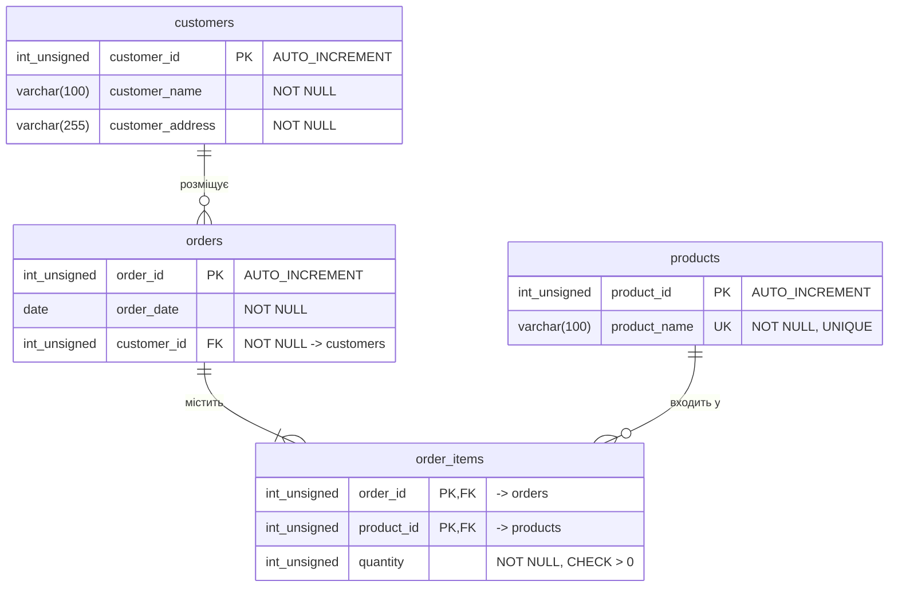

# Пункт 4. ER-діаграма нормалізованих таблиць

Діаграма відповідає схемі у 3НФ з [кроку 3](../normalization/p3_3nf.md).

## Сутності та їхні атрибути

### `customers` — клієнт

| Атрибут | Тип | Ключ | Обмеження | Значення |
|---------|-----|------|-----------|----------|
| `customer_id`      | `INT UNSIGNED` | PK | AUTO_INCREMENT | Унікальний ідентифікатор клієнта |
| `customer_name`    | `VARCHAR(100)` | — | NOT NULL | Прізвище / назва клієнта |
| `customer_address` | `VARCHAR(255)` | — | NOT NULL | Адреса клієнта, куди доставляють замовлення |

### `products` — товар

| Атрибут | Тип | Ключ | Обмеження | Значення |
|---------|-----|------|-----------|----------|
| `product_id`   | `INT UNSIGNED` | PK | AUTO_INCREMENT | Унікальний ідентифікатор товару |
| `product_name` | `VARCHAR(100)` | UQ | NOT NULL, UNIQUE | Назва товару; унікальна — один товар зберігається один раз |

### `orders` — замовлення

| Атрибут | Тип | Ключ | Обмеження | Значення |
|---------|-----|------|-----------|----------|
| `order_id`    | `INT UNSIGNED` | PK | AUTO_INCREMENT | Номер замовлення |
| `order_date`  | `DATE`         | —  | NOT NULL | Дата оформлення замовлення |
| `customer_id` | `INT UNSIGNED` | FK | NOT NULL → `customers.customer_id` | Клієнт, який зробив замовлення |

### `order_items` — позиція замовлення

| Атрибут | Тип | Ключ | Обмеження | Значення |
|---------|-----|------|-----------|----------|
| `order_id`   | `INT UNSIGNED` | PK, FK | → `orders.order_id` | Замовлення, до якого належить позиція |
| `product_id` | `INT UNSIGNED` | PK, FK | → `products.product_id` | Замовлений товар |
| `quantity`   | `INT UNSIGNED` | — | NOT NULL, CHECK `> 0` | Кількість одиниць цього товару в замовленні |

Первинний ключ складений — `(order_id, product_id)`. Це гарантує, що той самий
товар не потрапить у те саме замовлення двома рядками.

## Зв'язки та кардинальності

| Зв'язок | Кардинальність | Читається | Реалізація |
|---------|----------------|-----------|------------|
| `customers` → `orders` | **1 : 0..N** | Один клієнт може розмістити багато замовлень (або жодного); кожне замовлення належить рівно одному клієнту | `orders.customer_id` NOT NULL, FK на `customers` |
| `orders` → `order_items` | **1 : 1..N** | Одне замовлення містить одну або більше позицій; кожна позиція належить рівно одному замовленню | `order_items.order_id` FK на `orders`, `ON DELETE CASCADE` |
| `products` → `order_items` | **1 : 0..N** | Один товар може входити в багато замовлень (або в жодне); кожна позиція посилається рівно на один товар | `order_items.product_id` FK на `products`, `ON DELETE RESTRICT` |
| `orders` ↔ `products` | **M : N** | Замовлення містить багато товарів, товар входить у багато замовлень | Розв'язується таблицею-зв'язкою `order_items` |

### Обов'язковість участі

- **`orders`** — участь обов'язкова з боку клієнта: замовлення без клієнта
  існувати не може (`customer_id NOT NULL`).
- **`customers`** — участь необов'язкова: клієнта можна занести в базу до того,
  як він зробить перше замовлення (це та сама аномалія вставки, яку ми усунули
  в 3НФ).
- **`products`** — участь необов'язкова: товар може лежати в каталозі, поки
  його ніхто не замовив.
- **`order_items`** — участь обов'язкова з обох боків: позиція не існує без
  свого замовлення й без свого товару.

### Поведінка при видаленні

| FK | Правило | Чому |
|----|---------|------|
| `order_items` → `orders` | `ON DELETE CASCADE` | Позиція не має сенсу без замовлення — видаляється разом із ним |
| `order_items` → `products` | `ON DELETE RESTRICT` | Товар, який фігурує в замовленнях, не можна видалити — це зіпсувало б історію |
| `orders` → `customers` | `ON DELETE RESTRICT` | Клієнта з замовленнями не можна видалити, доки існують його замовлення |

Далі — [створення таблиць у БД](../sql/p5_create_tables.sql).
