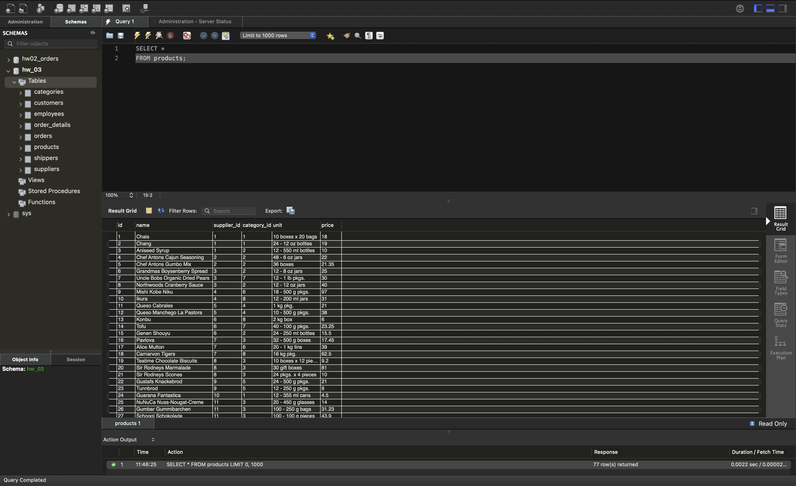
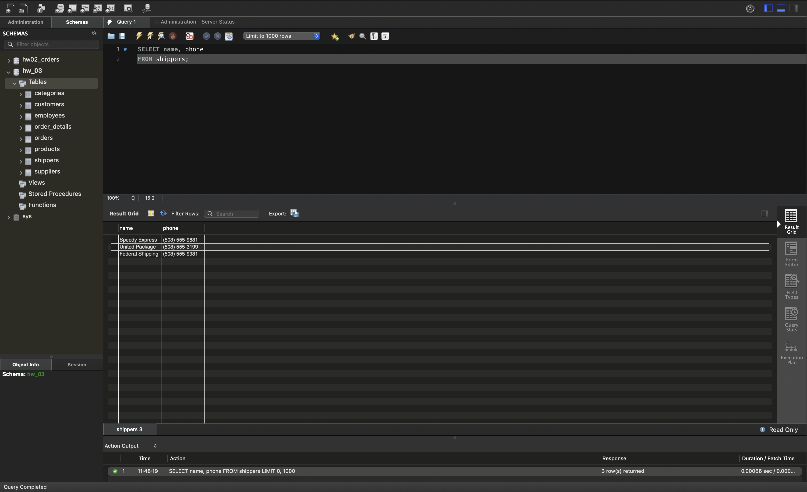
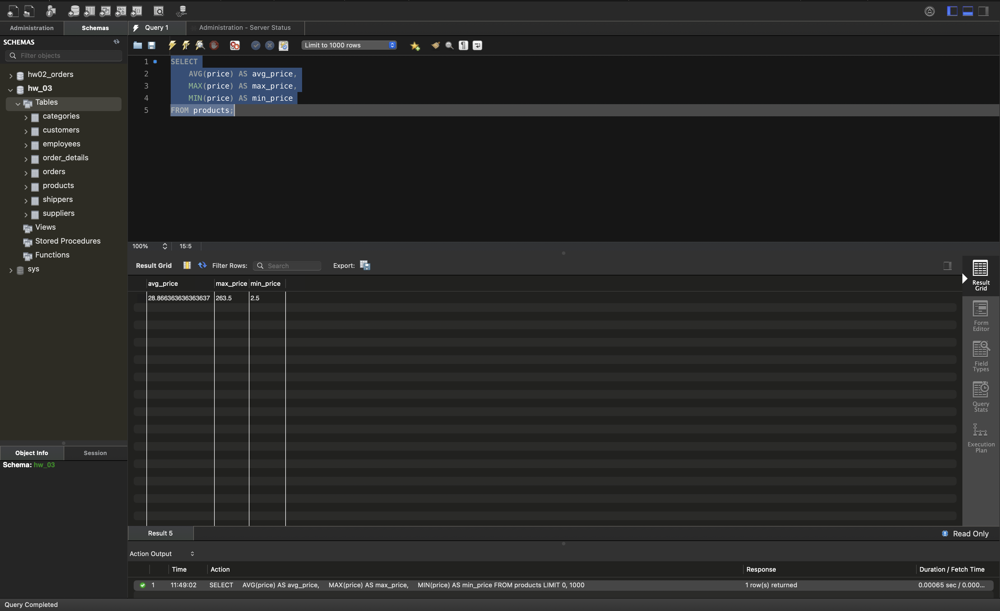
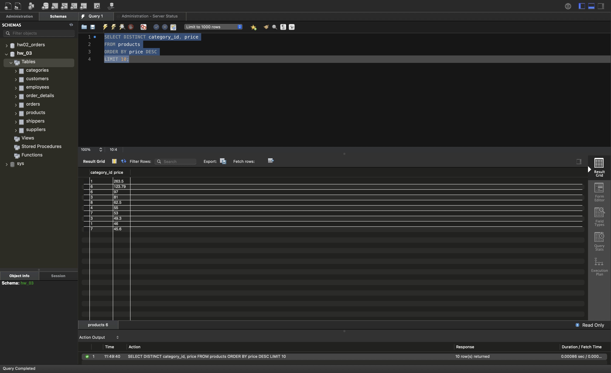
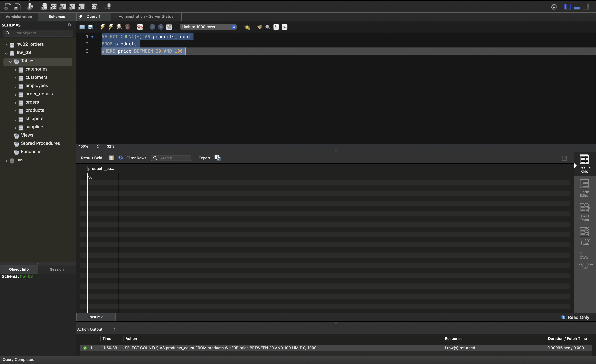
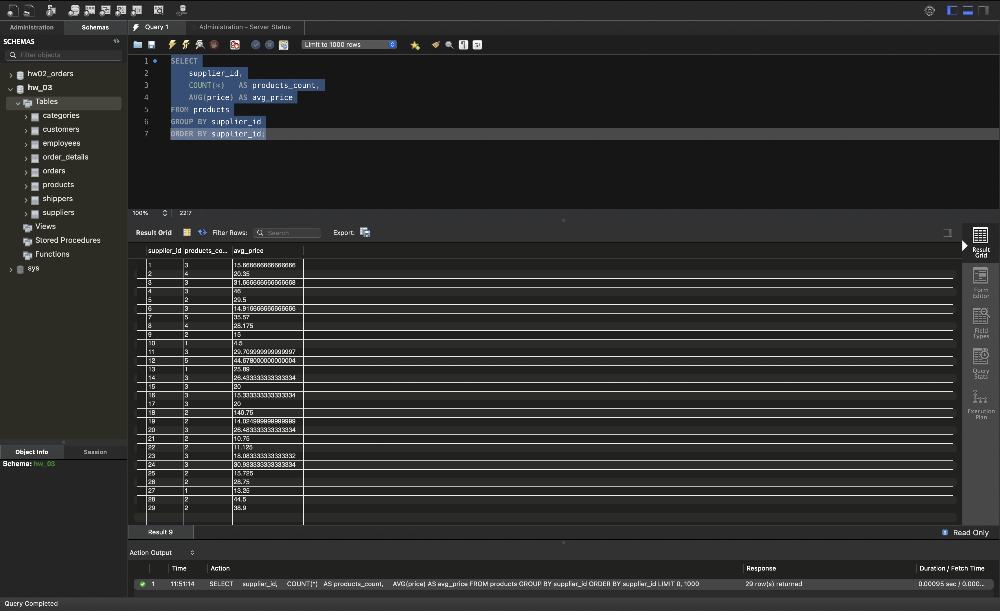

# Завантаження даних та основи SQL. DQL команди

Домашнє завдання 3. Запити до датасету, завантаженого у схему `hw_03`.

Увесь SQL-код зібрано у файлі [queries.sql](queries.sql).

---

## Завдання 1. Вибірка стовпчиків

### 1.1. Усі стовпчики таблиці `products`

```sql
SELECT *
FROM products;
```

Повертає всі рядки таблиці з усіма колонками: `id`, `name`, `supplier_id`,
`category_id`, `unit`, `price`. Результат — 77 рядків.



### 1.2. Стовпчики `name` і `phone` з таблиці `shippers`

```sql
SELECT name, phone
FROM shippers;
```

Повертає лише дві названі колонки — назву перевізника та його телефон.
Результат — 3 рядки.



---

## Завдання 2. Середня, максимальна та мінімальна ціна

```sql
SELECT
    AVG(price) AS avg_price,
    MAX(price) AS max_price,
    MIN(price) AS min_price
FROM products;
```

Агрегатні функції без `GROUP BY` обчислюють значення по всій таблиці, тому
результат — один рядок: середня ціна 28.87, максимальна 263.50, мінімальна 2.50.



---

## Завдання 3. Унікальні пари `category_id` і `price`

```sql
SELECT DISTINCT category_id, price
FROM products
ORDER BY price DESC
LIMIT 10;
```

`DISTINCT` застосовується до **комбінації** обох колонок: рядок потрапляє в
результат, якщо така пара «категорія + ціна» ще не траплялася. Одна й та сама
категорія може з'явитися кілька разів із різними цінами.

`ORDER BY price DESC` сортує за спаданням ціни, `LIMIT 10` залишає перші
10 рядків. У результаті категорії 1, 3, 6 і 7 трапляються двічі — з різними
цінами.



---

## Завдання 4. Кількість товарів у ціновому діапазоні 20–100

```sql
SELECT COUNT(*) AS products_count
FROM products
WHERE price BETWEEN 20 AND 100;
```

`BETWEEN` включає обидві межі, тобто товари з ціною рівно 20 або рівно 100
теж потрапляють у підрахунок. Результат — 36 товарів.



---

## Завдання 5. Кількість товарів і середня ціна кожного постачальника

```sql
SELECT
    supplier_id,
    COUNT(*)   AS products_count,
    AVG(price) AS avg_price
FROM products
GROUP BY supplier_id
ORDER BY supplier_id;
```

`GROUP BY supplier_id` розбиває рядки на групи за постачальником, і агрегатні
функції рахуються всередині кожної групи окремо. Результат — 29 рядків,
по одному на постачальника.


