# DML та DDL команди. Складні SQL вирази

Домашнє завдання 4. Створення схеми `LibraryManagement` за допомогою DDL,
наповнення таблиць тестовими даними та складні запити з `JOIN` до датасету
з теми 3 (схема `hw_03`).

```
rdb_hw_topic_04/
├── sql/
│   ├── p1_create_schema.sql     # пункт 1 — DDL
│   ├── p2_insert_data.sql       # пункт 2 — DML
│   ├── p3_join_all_tables.sql   # пункт 3 — об'єднання восьми таблиць
│   └── p4_queries.sql           # пункт 4 — запити 4.1–4.7
└── screenshots/
    ├── p1/                      # схема LibraryManagement
    ├── p2/                      # тестові дані
    ├── p3/                      # об'єднання восьми таблиць
    └── p4/                      # запити 4.1–4.7
```

---

## Завдання 1. База даних LibraryManagement

Створено схему `LibraryManagement` і п'ять таблиць — [sql/p1_create_schema.sql](sql/p1_create_schema.sql).

| Таблиця | Стовпчики | Ключі |
|---------|-----------|-------|
| `authors` | `author_id`, `author_name` | PK `author_id` (AUTO_INCREMENT) |
| `genres` | `genre_id`, `genre_name` | PK `genre_id` (AUTO_INCREMENT) |
| `books` | `book_id`, `title`, `publication_year`, `author_id`, `genre_id` | PK `book_id`; FK на `authors` і `genres` |
| `users` | `user_id`, `username`, `email` | PK `user_id` (AUTO_INCREMENT) |
| `borrowed_books` | `borrow_id`, `book_id`, `user_id`, `borrow_date`, `return_date` | PK `borrow_id`; FK на `books` і `users` |

`publication_year` має тип `YEAR`, `borrow_date` і `return_date` — `DATE`.

Створені зовнішні ключі:

```
books.author_id           -> authors.author_id
books.genre_id            -> genres.genre_id
borrowed_books.book_id    -> books.book_id
borrowed_books.user_id    -> users.user_id
```

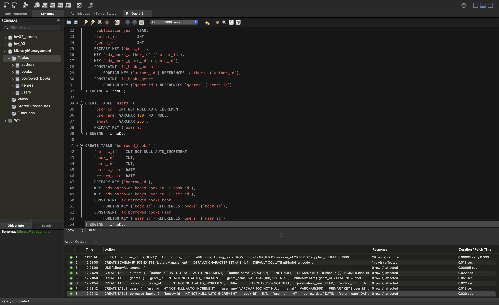

---

## Завдання 2. Тестові дані

По два рядки в кожну таблицю — [sql/p2_insert_data.sql](sql/p2_insert_data.sql).
Значення `author_id`, `genre_id`, `book_id` і `user_id` не вказуються явно:
їх проставляє `AUTO_INCREMENT`.

У таблиці `borrowed_books` перший запис має заповнений `return_date` (книга
повернена), другий — `NULL` (книга ще на руках).

Виконання команд `INSERT`:

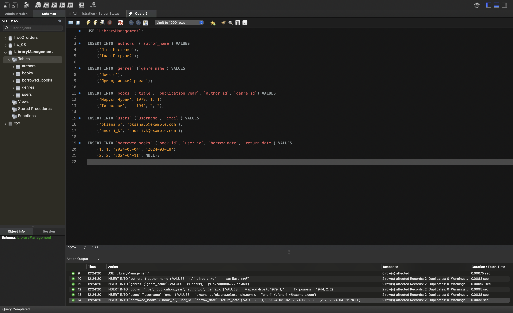

Перевірочний запит, який показує вміст усіх п'яти таблиць одночасно. Він же
підтверджує, що зовнішні ключі пов'язані правильно — книга підтягує свого
автора та свій жанр, а не випадкові:

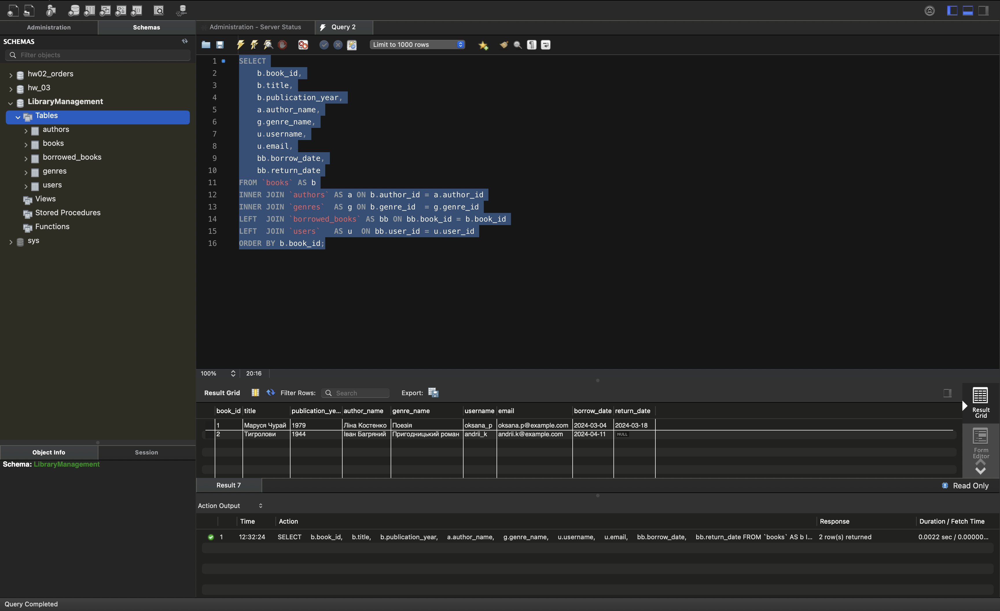

---

## Завдання 3. Об'єднання восьми таблиць

Запит — [sql/p3_join_all_tables.sql](sql/p3_join_all_tables.sql).

Спільні ключі, за якими з'єднуються таблиці:

| Зв'язок | Умова |
|---------|-------|
| `order_details` → `orders` | `od.order_id = o.id` |
| `order_details` → `products` | `od.product_id = p.id` |
| `orders` → `customers` | `o.customer_id = c.id` |
| `orders` → `employees` | `o.employee_id = e.employee_id` |
| `orders` → `shippers` | `o.shipper_id = sh.id` |
| `products` → `categories` | `p.category_id = ct.id` |
| `products` → `suppliers` | `p.supplier_id = su.id` |

Точкою входу обрано `order_details` — це найдетальніша таблиця, один її рядок
відповідає одній позиції замовлення. Усі інші таблиці приєднуються до неї
безпосередньо або через `orders` і `products`.

Зверніть увагу: у таблиці `employees` первинний ключ називається
`employee_id`, а не `id`, як в інших таблицях.

**Результат: 518 рядків.**

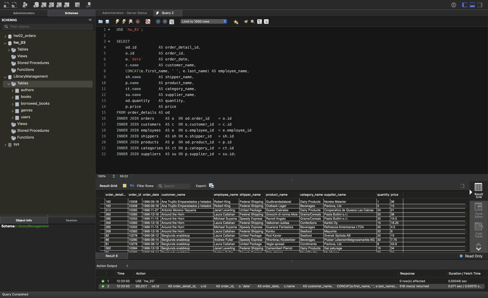

---

## Завдання 4

### 4.1. Кількість рядків

```sql
SELECT COUNT(*) AS rows_count FROM order_details ... INNER JOIN ...;
```

**518 рядків** — рівно стільки, скільки рядків у таблиці `order_details`.

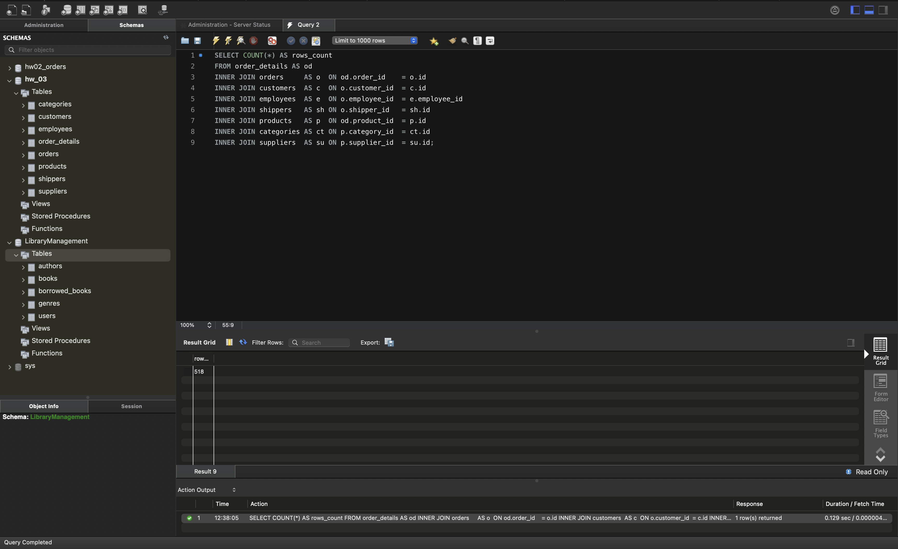

### 4.2. Заміна INNER на LEFT або RIGHT

Виміряні значення:

| Варіант запиту | Кількість рядків |
|----------------|------------------|
| Усі з'єднання `INNER` | 518 |
| Усі з'єднання `LEFT` | 518 |
| `RIGHT JOIN` на `customers`, решта `INNER` | 518 |
| `RIGHT JOIN` на `customers`, після нього всі `LEFT` | **535** |

Кількість рядків змінюється не від самої заміни оператора, а від того, чи
залишився далі в ланцюжку `INNER JOIN`, який відкине рядки з `NULL`.

Усі з'єднання замінено на `LEFT` — 518:

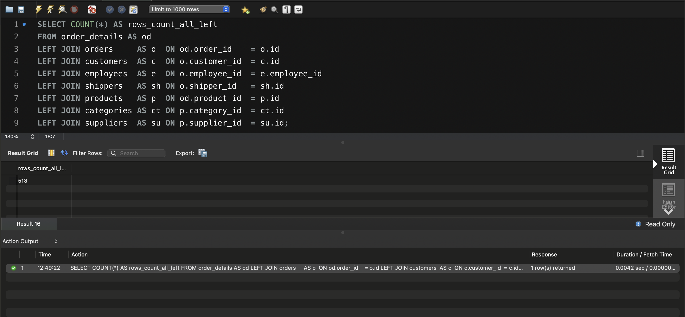

`RIGHT JOIN` на `customers`, решта `INNER` — теж 518:

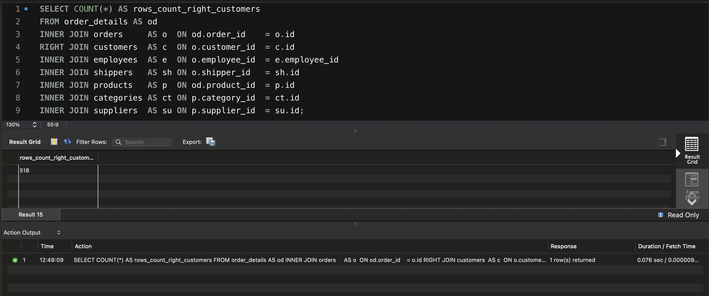

Той самий `RIGHT JOIN` на `customers`, але після нього всі з'єднання `LEFT` — 535:

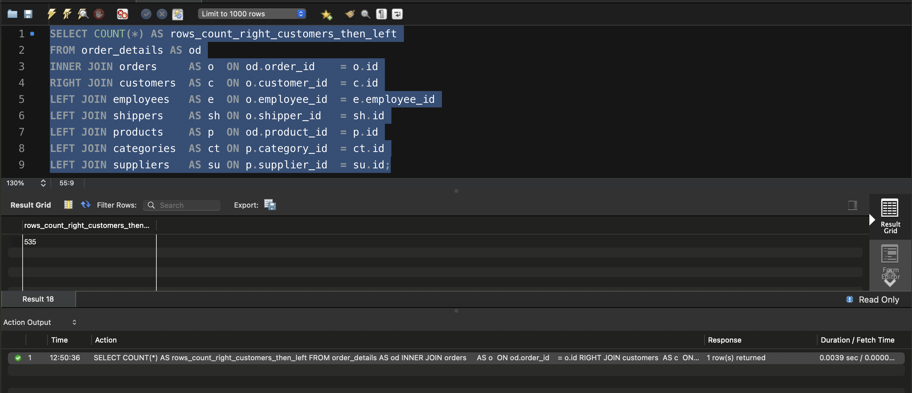

**Чому так.**

`INNER JOIN` залишає тільки ті рядки, для яких пара знайшлася в обох таблицях.
`LEFT JOIN` додатково зберігає всі рядки лівої таблиці, підставляючи `NULL`
там, де пари немає. `RIGHT JOIN` робить те саме для правої таблиці.

**Заміна на `LEFT` нічого не змінює — рядків так само 518.** Причина в тому,
що в цьому датасеті немає «осиротілих» рядків: кожен рядок `order_details`
посилається на існуюче замовлення й існуючий товар, кожне замовлення має
клієнта, працівника та перевізника, кожен товар — категорію й постачальника.
Оскільки пара знаходиться завжди, `LEFT JOIN` не має чого додати, і результат
збігається з `INNER JOIN`.

**Заміна на `RIGHT`, коли решта залишається `INNER`, теж дає 518.** У базі є
17 клієнтів, які не зробили жодного замовлення, і `RIGHT JOIN` справді витягує
їх у проміжний результат — з `NULL` у стовпчиках замовлення. Але далі в
ланцюжку стоять `INNER JOIN` з `employees`, `shippers` і `products`, і вони ці
рядки відкидають: у них `o.employee_id` дорівнює `NULL`, отже умова з'єднання
не виконується.

**А от коли після `RIGHT JOIN` усі наступні з'єднання теж зовнішні — рядків
стає 535.** Це ті самі 518 плюс 17 клієнтів без замовлень: тепер їх нікому
відфільтрувати, і вони доходять до результату з `NULL` у всіх стовпчиках
замовлення, товару й категорії.

**Висновок:** сам по собі `LEFT` чи `RIGHT` кількість рядків не змінює.
Вона змінюється тоді, коли зовнішнє з'єднання додає рядки без відповідників
**і** далі в ланцюжку немає жодного `INNER JOIN`, який ці рядки з `NULL`
відфільтрує. Достатньо одного `INNER JOIN` після зовнішнього — і приріст
зникає.

### 4.3. Тільки рядки з `employee_id` більшим за 3 та не більшим за 10

```sql
WHERE o.employee_id > 3 AND o.employee_id <= 10
```

**317 рядків** із 518.

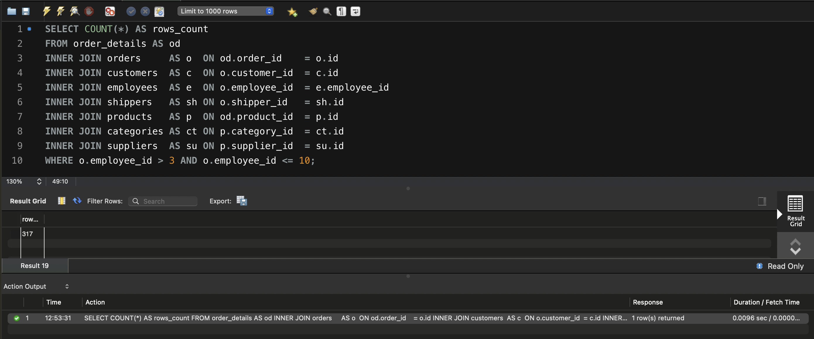

### 4.4. Групування за назвою категорії

`GROUP BY ct.name` з `COUNT(*)` та `AVG(od.quantity)` — **8 груп**:

| category_name | rows_count | avg_quantity |
|---------------|-----------:|-------------:|
| Beverages | 62 | 25.1290 |
| Dairy Products | 58 | 27.4655 |
| Confections | 51 | 23.8627 |
| Seafood | 40 | 22.7000 |
| Meat/Poultry | 31 | 21.5806 |
| Condiments | 30 | 26.9000 |
| Grains/Cereals | 24 | 20.7083 |
| Produce | 21 | 25.2381 |

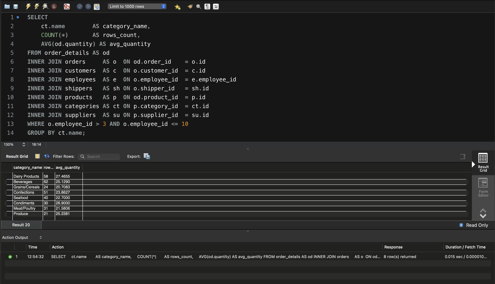

### 4.5. Фільтр груп за середньою кількістю

```sql
HAVING AVG(od.quantity) > 21
```

Залишається **7 груп**. Відпадає `Grains/Cereals` із середньою кількістю
20.7083 — це єдина категорія, що не проходить поріг.

Умова застосовується саме через `HAVING`, а не `WHERE`, бо фільтрувати треба
вже за результатом агрегатної функції, який обчислюється після групування.

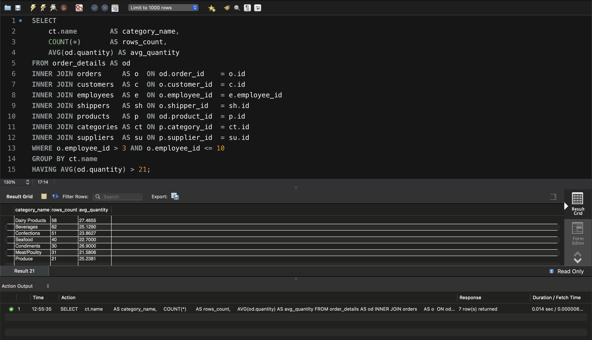

### 4.6. Сортування за спаданням кількості рядків

```sql
ORDER BY rows_count DESC
```

| category_name | rows_count | avg_quantity |
|---------------|-----------:|-------------:|
| Beverages | 62 | 25.1290 |
| Dairy Products | 58 | 27.4655 |
| Confections | 51 | 23.8627 |
| Seafood | 40 | 22.7000 |
| Meat/Poultry | 31 | 21.5806 |
| Condiments | 30 | 26.9000 |
| Produce | 21 | 25.2381 |

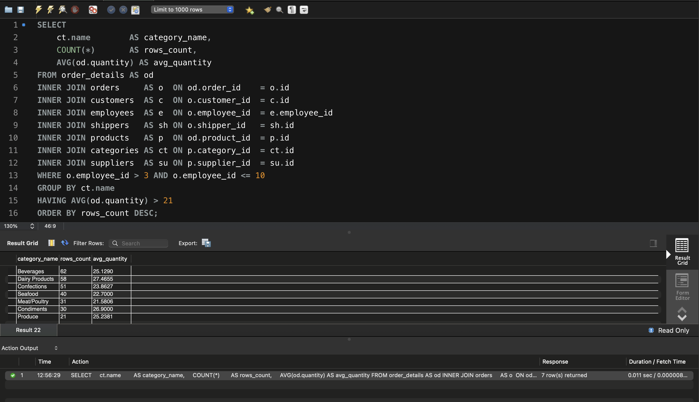

### 4.7. Чотири рядки з пропущеним першим

```sql
LIMIT 4 OFFSET 1
```

`OFFSET 1` пропускає перший рядок відсортованого результату, `LIMIT 4` бере
наступні чотири. `Beverages` пропущено:

| category_name | rows_count | avg_quantity |
|---------------|-----------:|-------------:|
| Dairy Products | 58 | 27.4655 |
| Confections | 51 | 23.8627 |
| Seafood | 40 | 22.7000 |
| Meat/Poultry | 31 | 21.5806 |

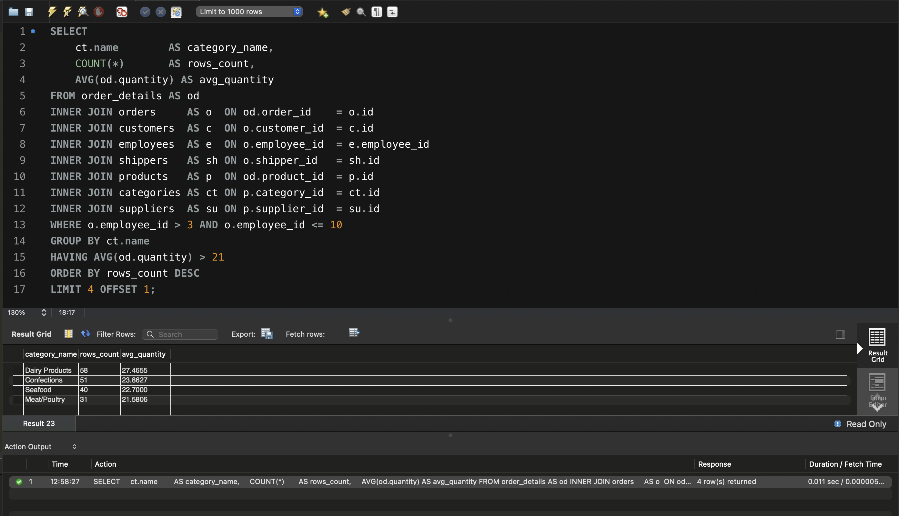
