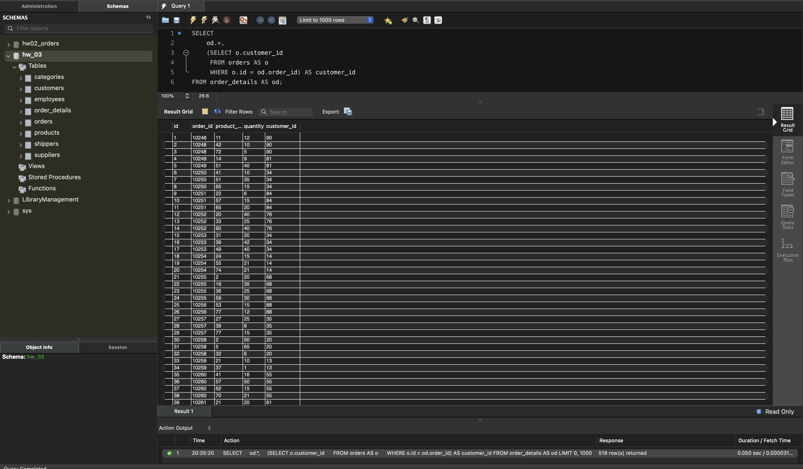
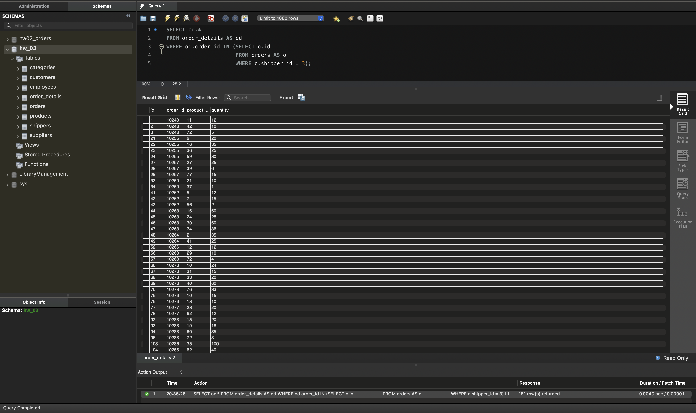
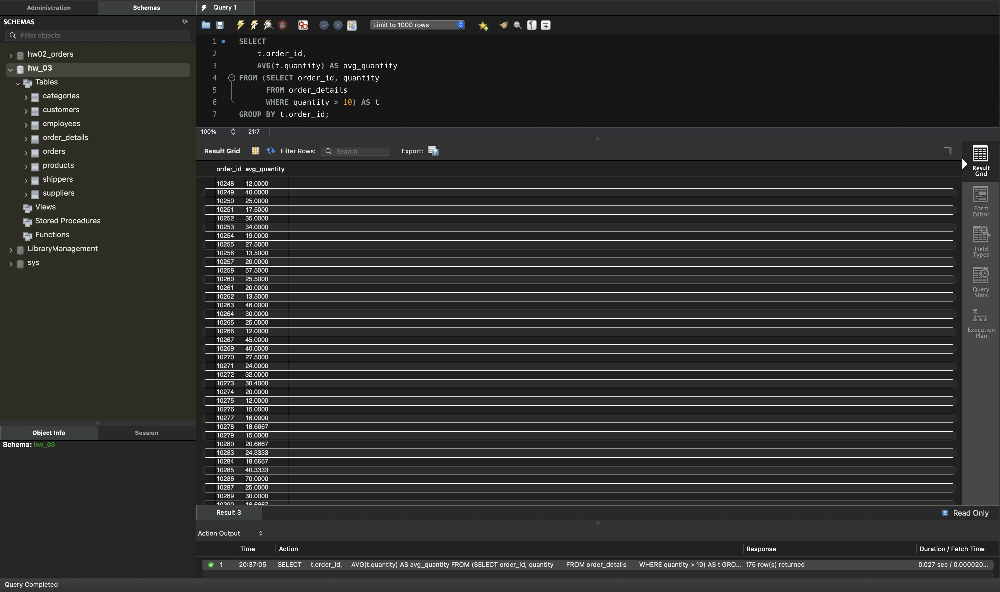
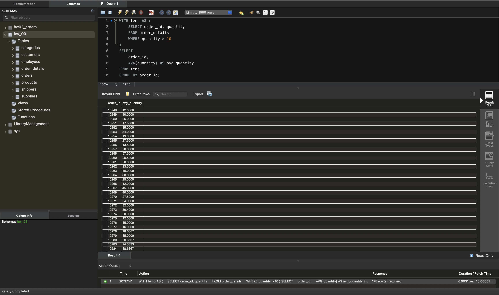
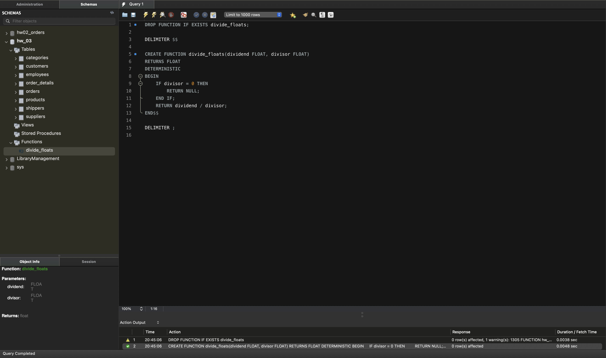
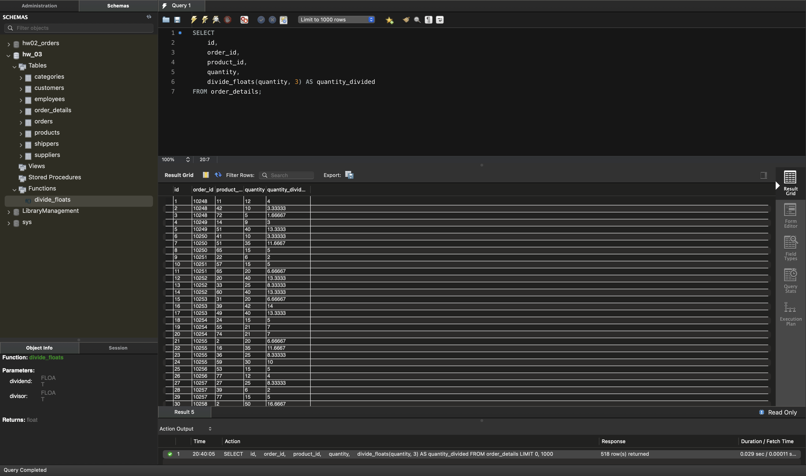

# Вкладені запити. Повторне використання коду

Домашнє завдання 5. Запити до схеми `hw_03` — датасету, завантаженого в темі 3.
Використано таблиці `order_details` (518 рядків) і `orders` (196 рядків).

Увесь SQL-код зібрано у файлі [sql/queries.sql](sql/queries.sql).

---

## Завдання 1. Вкладений запит в операторі SELECT

Таблиця `order_details` і поле `customer_id` з `orders` для кожного рядка.

```sql
SELECT
    od.*,
    (SELECT o.customer_id
     FROM orders AS o
     WHERE o.id = od.order_id) AS customer_id
FROM order_details AS od;
```

Це корельований підзапит: він виконується для кожного рядка `order_details`
окремо й посилається на зовнішню таблицю через `o.id = od.order_id`. Підзапит
у `SELECT` зобов'язаний повертати рівно одне значення — тут це гарантовано,
бо `orders.id` унікальний.

**Результат: 518 рядків** — стільки ж, скільки в `order_details`. Кількість
рядків не змінюється, додається лише один стовпчик.



---

## Завдання 2. Вкладений запит в операторі WHERE

Рядки `order_details`, у яких відповідне замовлення має `shipper_id = 3`.

```sql
SELECT od.*
FROM order_details AS od
WHERE od.order_id IN (SELECT o.id
                      FROM orders AS o
                      WHERE o.shipper_id = 3);
```

Підзапит повертає список ідентифікаторів замовлень, доставлених перевізником
номер 3, а `IN` залишає тільки ті позиції, чий `order_id` є в цьому списку.

**Результат: 181 рядок** із 518.



---

## Завдання 3. Вкладений запит в операторі FROM

Середня кількість товару в розрізі замовлень, рахуючи лише позиції з
`quantity > 10`.

```sql
SELECT
    t.order_id,
    AVG(t.quantity) AS avg_quantity
FROM (SELECT order_id, quantity
      FROM order_details
      WHERE quantity > 10) AS t
GROUP BY t.order_id;
```

Підзапит у `FROM` створює похідну таблицю — спочатку відбираються позиції з
кількістю більшою за 10, і вже над цим набором рахується середнє. Похідна
таблиця обов'язково потребує псевдоніма, тут це `AS t`.

Умову `quantity > 10` тут не можна замінити на `HAVING`: `HAVING` фільтрує
вже готові групи за агрегатом, а нам треба відкинути окремі рядки **до**
групування.

**Результат: 175 груп.** Із 518 позицій умові `quantity > 10` відповідають
386, і вони розподіляються по 175 замовленнях.



---

## Завдання 4. Те саме через оператор WITH

```sql
WITH temp AS (
    SELECT order_id, quantity
    FROM order_details
    WHERE quantity > 10
)
SELECT
    order_id,
    AVG(quantity) AS avg_quantity
FROM temp
GROUP BY order_id;
```

`WITH` створює тимчасову іменовану вибірку (CTE), яку далі видно в основному
запиті як звичайну таблицю. Результат ідентичний завданню 3 — ті самі 175
рядків із тими самими значеннями; відрізняється лише форма запису.

Перевага `WITH` у читабельності: підготовка даних винесена нагору окремим
блоком з іменем, а основний запит залишається коротким. Якщо та сама
проміжна вибірка потрібна в кількох місцях запиту, CTE дозволяє описати її
один раз замість того, щоб дублювати підзапит.

CTE доступні починаючи з MySQL 8.0.



---

## Завдання 5. Функція ділення

```sql
DROP FUNCTION IF EXISTS divide_floats;

DELIMITER $$

CREATE FUNCTION divide_floats(dividend FLOAT, divisor FLOAT)
RETURNS FLOAT
DETERMINISTIC
BEGIN
    IF divisor = 0 THEN
        RETURN NULL;
    END IF;
    RETURN dividend / divisor;
END$$

DELIMITER ;
```

Обидва параметри та значення, що повертається, мають тип `FLOAT`, як вимагає
умова. `DROP FUNCTION IF EXISTS` на початку робить скрипт повторюваним: без
нього повторний запуск впав би з помилкою «функція вже існує».

Три деталі реалізації:

- **`DELIMITER $$`** потрібен тому, що тіло функції саме містить крапку з
  комою. Без зміни роздільника клієнт обірвав би команду на першому ж `;`
  всередині `BEGIN ... END`.
- **`DETERMINISTIC`** обов'язковий, коли ввімкнено бінарне логування: інакше
  MySQL відмовиться створювати функцію з помилкою 1418. Функція справді
  детермінована — на однакових аргументах завжди повертає однаковий результат.
- **Перевірка `divisor = 0`** повертає `NULL` замість помилки ділення на нуль.



Попередження 1305 біля `DROP FUNCTION IF EXISTS` — очікуване: воно означає,
що функції ще не існувало. Саме для цього й потрібне `IF EXISTS` — замість
падіння з помилкою команда просто повідомляє про це. Завдяки цьому скрипт
можна виконувати повторно.

Застосування до атрибута `quantity`, другий параметр — 3:

```sql
SELECT
    id,
    order_id,
    product_id,
    quantity,
    divide_floats(quantity, 3) AS quantity_divided
FROM order_details;
```

**Результат: 518 рядків.** Перевірка роботи функції:

| Виклик | Результат |
|--------|-----------|
| `divide_floats(12, 3)` | 4 |
| `divide_floats(10, 3)` | 3.33333 |
| `divide_floats(5, 0)` | NULL |


